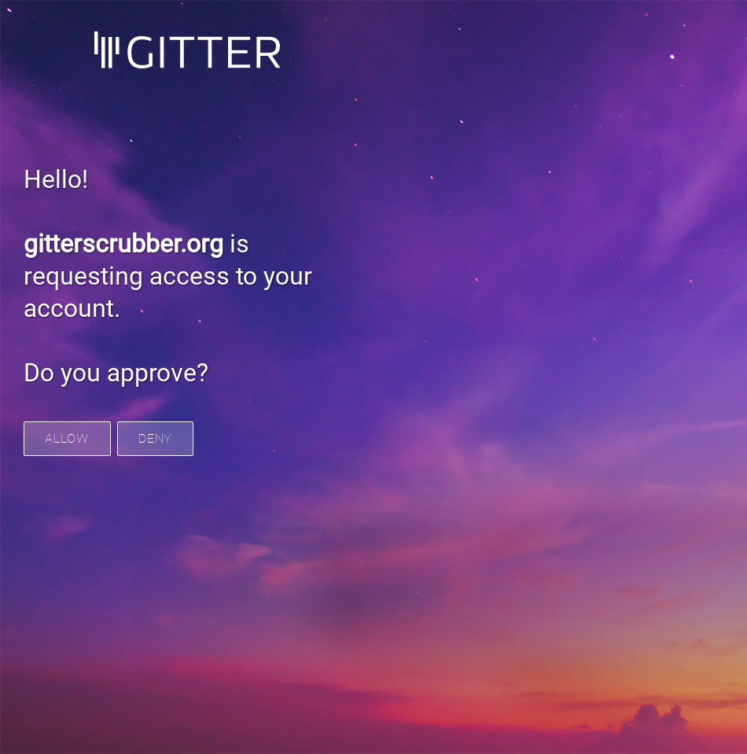

# gitterscrubber.org
This Node.js script allows you to host a server capable of getting authentication accepts from a Gitter URL and then gradually delete all of your messages in all of the rooms you currently participate in. You can select in the code if you want to remove one-to-one messages or only messages in public rooms.

## Get your OAuth tokens from Gitter developer sites
To use it you need to open gitterscrubber.js, put in your Gitter OAuth key and secret together with a valid redirect that points to this server you are hosting. When running the server it will print to stdout a link which you can click on in your browser, accept the authentication and then the server will go through all rooms and delete your messages.

## gitterscrubber.org as a real website?
This fictional site, gitterscrubber.org, could potentially be hosted to allow any user to simply navigate to http://gitterscrubber.org/, click Accept and then get a nice list of what rooms will be deleted. I don't have the time and intereset to host this but if someone wants to give it a go that would be totally fine with me. The script will probably need some more stability fixes but it has worked for me and allowed me to delete all of my messages.

